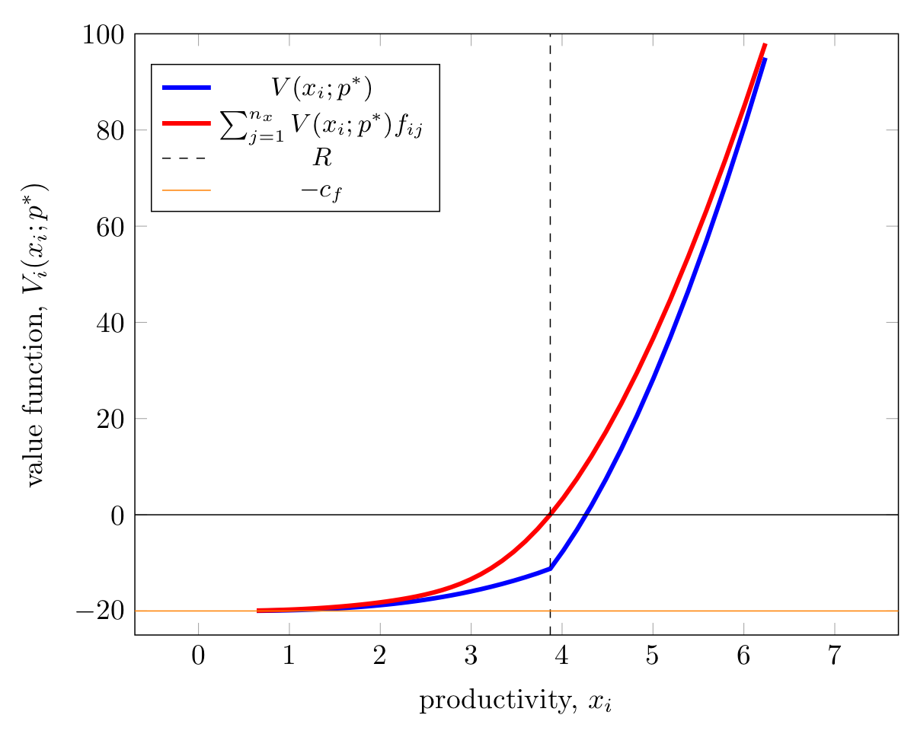
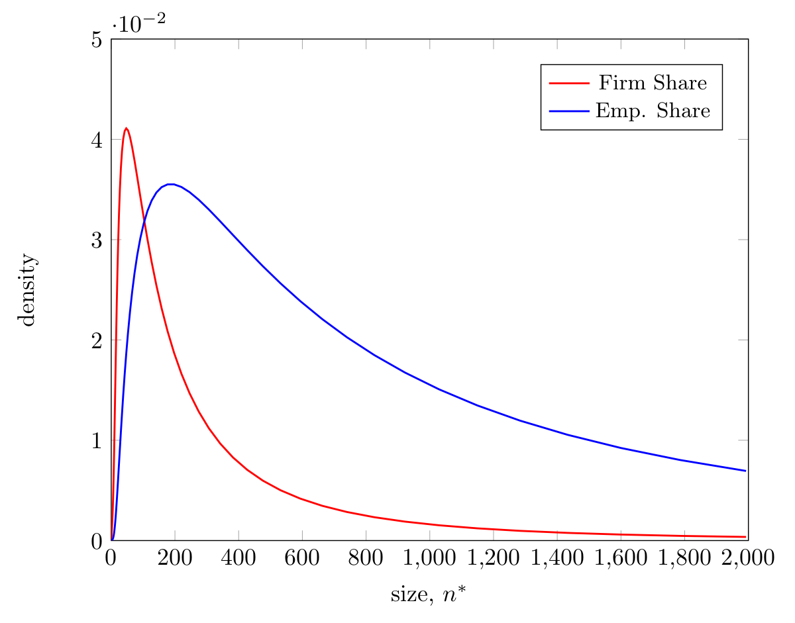
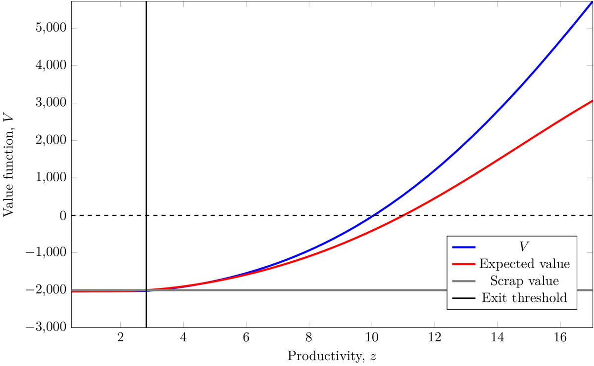
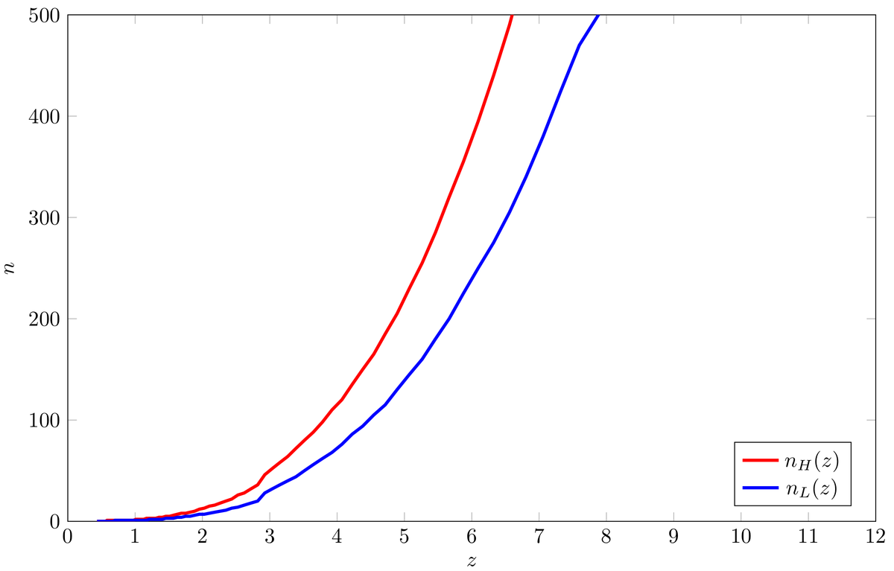
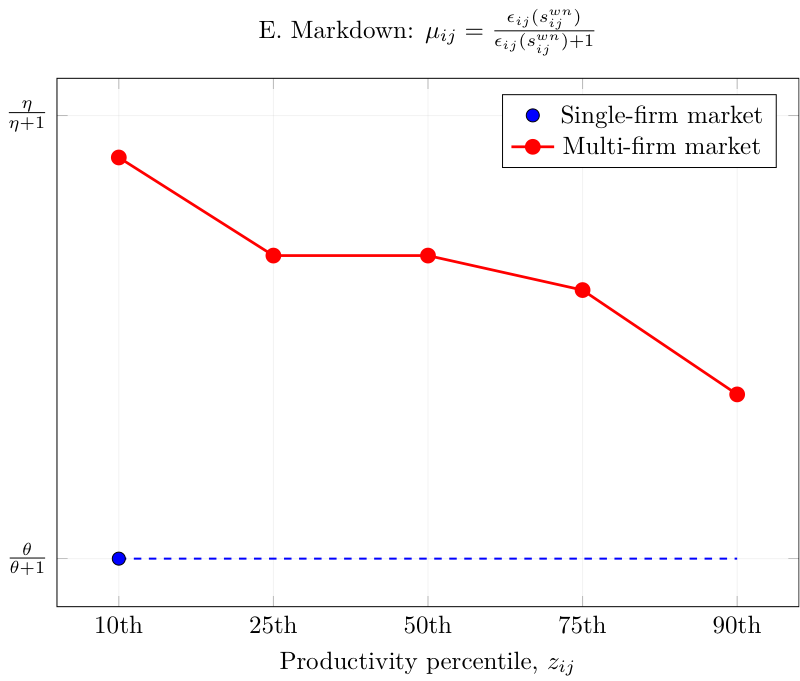
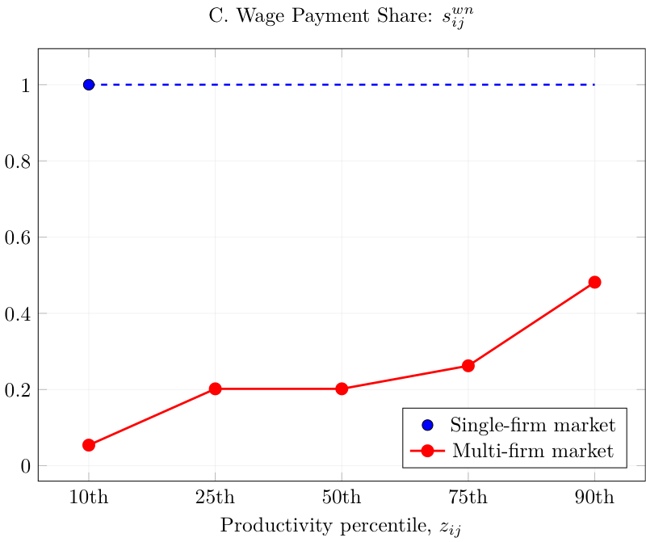

::: {.layout-grid}

::: {.left-col}

Samiran Dutta

{.headshot}

PhD Candidate in Economics 
Paris School of Economics

<a href="mailto:samiran.dutta@psemail.eu">samiran.dutta@psemail.eu</a>

<a href="files/cv.pdf" class="cv-bracket" target="_blank">&lt;&nbsp;CV&nbsp;&gt;</a>
&lt;&nbsp;<a href="https://github.com/samirandutta" target="_blank" rel="noopener" aria-label="GitHub" class="social-icon-link"><svg xmlns="http://www.w3.org/2000/svg" width="15" height="15" fill="currentColor" viewBox="0 0 16 16"><path d="M8 0C3.58 0 0 3.58 0 8c0 3.54 2.29 6.53 5.47 7.59.4.07.55-.17.55-.38 0-.19-.01-.82-.01-1.49-2.01.37-2.53-.49-2.69-.94-.09-.23-.48-.94-.82-1.13-.28-.15-.68-.52-.01-.53.63-.01 1.08.58 1.23.82.72 1.21 1.87.87 2.33.66.07-.52.28-.87.51-1.07-1.78-.2-3.64-.89-3.64-3.95 0-.87.31-1.59.82-2.15-.08-.2-.36-1.02.08-2.12 0 0 .67-.21 2.2.82.64-.18 1.32-.27 2-.27s1.36.09 2 .27c1.53-1.04 2.2-.82 2.2-.82.44 1.1.16 1.92.08 2.12.51.56.82 1.27.82 2.15 0 3.07-1.87 3.75-3.65 3.95.29.25.54.73.54 1.48 0 1.07-.01 1.93-.01 2.2 0 .21.15.46.55.38A8.01 8.01 0 0 0 16 8c0-4.42-3.58-8-8-8z"/></svg></a>&nbsp;<a href="https://scholar.google.com/citations?user=Nul09cIAAAAJ&hl=en" target="_blank" rel="noopener" aria-label="Google Scholar" class="social-icon-link"><svg xmlns="http://www.w3.org/2000/svg" width="15" height="15" fill="currentColor" viewBox="0 0 24 24"><path d="M5.242 13.769 0 9.5 12 0l12 9.5-5.242 4.269C17.548 11.249 14.978 9.5 12 9.5c-2.977 0-5.548 1.748-6.758 4.269zM12 10a7 7 0 1 0 0 14 7 7 0 0 0 0-14z"/></svg></a>&nbsp;<a href="https://x.com/samiran_dutta19" target="_blank" rel="noopener" aria-label="Twitter/X" class="social-icon-link"><svg xmlns="http://www.w3.org/2000/svg" width="14" height="14" fill="currentColor" viewBox="0 0 24 24"><path d="M18.244 2.25h3.308l-7.227 8.26 8.502 11.24H16.17l-5.214-6.817L4.99 21.75H1.68l7.73-8.835L1.254 2.25H8.08l4.713 6.231zm-1.161 17.52h1.833L7.084 4.126H5.117z"/></svg></a>&nbsp;&gt;

:::

::: {.right-col}

<a href="#working-papers">Working Papers</a>
<a href="#work-in-progress">Work in Progress</a>
<a href="#publications">Publications</a>
<a href="#teaching">Teaching</a>
<a href="#code">Code</a>

I am a PhD candidate in Economics at the Paris School of Economics. My research lies at the intersection of macroeconomics and labor economics, with a focus on firm dynamics, labor market frictions, and multi-worker wage bargaining. In Spring 2025, I was a visiting scholar at the University of Edinburgh, hosted by [Prof. Mike Elsby](https://sites.google.com/site/mikeelsby/){target="_blank"} and [Prof. Axel Gottfries](https://sites.google.com/site/axelgottfries/){target="_blank"}.

Prior to my doctoral studies, I earned an MRes in Economics from the Paris School of Economics and a B.A. (Hons.) from University of Delhi. I was previously affiliated with the India-KLEMS project at the Centre for Development Economics, Delhi School of Economics, where I worked on the production of the [India Productivity Report](https://rbi.org.in/Scripts/PublicationReportDetails.aspx?UrlPage=&ID=1217){target="_blank"} in collaboration with the Reserve Bank of India.

## WORK IN PROGRESS {#work-in-progress}

The Reserve Army of Labor: Firm Dynamics and Dual Labor Markets in India

<button class="toggle-btn" onclick="togglePanel(this,'ra-abstract')">Abstract</button>
<button class="toggle-btn" onclick="togglePanel(this,'ra-presentations')">Presentations</button>
<button class="toggle-btn" onclick="togglePanel(this,'ra-funding')">Funding</button>

This paper develops a search-and-matching model of large firms with productivity heterogeneity, dual labor markets, and unionized wage bargaining. Firms hire through two channels — a regular labor market with matching frictions, adjustment costs, and collective bargaining, and a contract labor market where contractors supply workers for a per-head fee without frictions. Adjustment costs generate inaction regions in regular employment — consistent with novel establishment-level evidence from India's manufacturing sector — while contract labor provides a flexible margin to absorb productivity shocks. Larger firms strategically "overemploy" contract workers, using them not only as a substitute input but also to exert downward pressure on union-negotiated regular worker wages. The model replicates key empirical patterns in India's manufacturing sector, where contract workers function as a de facto "reserve" workforce, offering flexibility and surplus value through wage compression. The framework highlights an output–wage trade-off — contract labor reduces misallocation by easing adjustment but simultaneously weakens collective bargaining, compressing regular wages.

Macro Workshop, PSE (May 2024, October 2025); Macro Reading Group, University of Edinburgh (April 2025); Labor/Public Reading Group, Sciences Po (October 2025); ACEGD, ISI Delhi (December 2025)

EUR PgSE.

Unions, Hold-up, and Joint Dynamics of Labor and Capital

with Alex McQuitty

Public Infrastructure and Intra-Sector Misallocation: Theory and Evidence from India

with François Fontaine and Sarath C. Mudigonda

## WORKING PAPERS {#working-papers}

Investigating the Prevalence of 'Missing Middle' in Indian Manufacturing

with B. N. Goldar and P. Majumder

<button class="toggle-btn" onclick="togglePanel(this,'mm-abstract')">Abstract</button>

This paper re-examines the "missing middle" in Indian manufacturing using unit-level data from the NSS 73rd Round and the ASI for 2015–16, covering unorganized and organized segments, respectively. Moving beyond size-class employment shares, we adopt a Pareto-based empirical strategy to assess deviations in the firm-size distribution. The findings indicate evidence consistent with a missing middle, further supported by variations in survival probabilities across size classes. 

## PUBLICATIONS {#publications}

The Role of Services in India's Post-Reform Economic Growth

with B. N. Goldar and P. C. Das — *Structural Change and Economic Dynamics*, 2024

<button class="toggle-btn" onclick="togglePanel(this,'services-abstract')">Abstract</button>
<button class="toggle-btn" onclick="togglePanel(this,'services-presentations')">Presentations</button>

Leveraging industry-level data from the India KLEMS database for 1993–2018, we trace how services became India's principal growth driver after the 1990s reforms. Over the period, the sector's value-added share rose from 41% to 53% and real output grew 7.5 % per year — roughly half of aggregate GDP growth. We estimate total factor productivity (TFP) for 14 service industries and decompose their contributions to sector-wide TFP. Transport & storage emerges as the single largest contributor among market services, followed by financial services; in non-market activities, public administration dominates. Panel regressions reveal strong positive spillovers from manufacturing TFP to both market and non-market services, while an augmented model with foreign-sector variables confirms significant productivity diffusion from advanced economies. Taken together, the results highlight inter-sectoral and international linkages as critical channels sustaining India's service-led growth.

Seventh World KLEMS Conference, University of Manchester (virtual)

## TEACHING {#teaching}

- **Research methods in Econometrics** — Masters in Economics and Psychology, PSE (2026)
- **Introduction to Econometrics** — Masters in Economics and Psychology, PSE (2024, 2025)
- **International Trade** —  Undergraduate L3, Université Paris 1 Pantheón-Sorbonne (2024)
- **Macroeconomics - Growth Theory** — Masters, QEM, Université Paris 1 Pantheón-Sorbonne (2023)

## CODE {#code}

### [**> Macro-Labor Models**](https://github.com/samirandutta/macro_labor_models){target="_blank"}

The repository contains JULIA code for replicating the main results of seminal models in macro-labor. These are updated as I progress through my own learning. 

<button class="toggle-btn" onclick="togglePanel(this,'model-hop92')"> Hopenhayn (1992)</button>

Industry equilibrium with heterogeneous firms, entry/exit, and stationary firm-size distributions. Solves for the value function, stationary distribution of firms, and equilibrium entry/exit cutoffs.

<button class="toggle-btn" onclick="togglePanel(this,'model-hopreg93')"> Hopenhayn and Rogerson (1993)</button>

General equilibrium with firing costs and labor misallocation. Solves for the value function, stationary distribution of firms, equilibrium cutoff and inaction thresholds. 

<button class="toggle-btn" onclick="togglePanel(this,'model-berg22')"> Berger, Herkenhoff and Mongey (2022)</button>

Labor market power with monopsonistic firms. Computes monopsony wedges, markdown on wages, and the aggregate output and welfare effects of market concentration.

:::

:::

